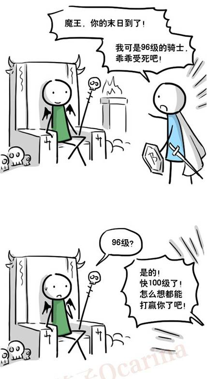
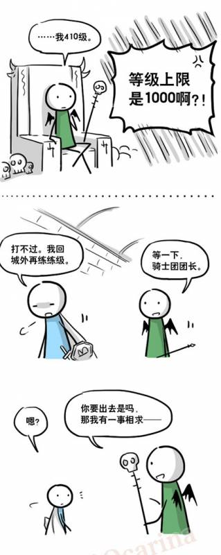
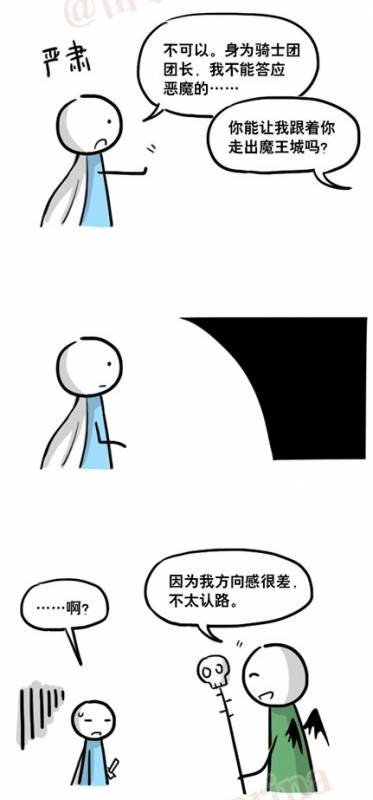
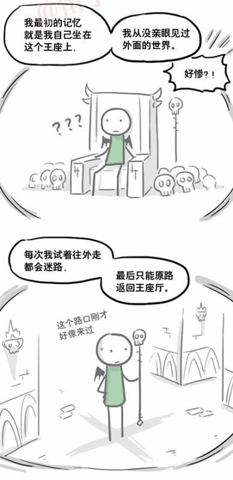
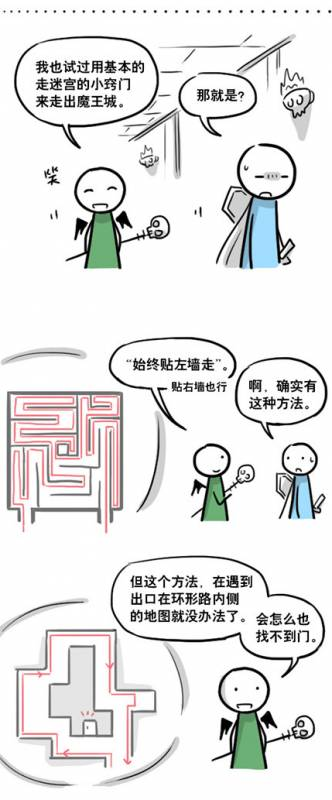
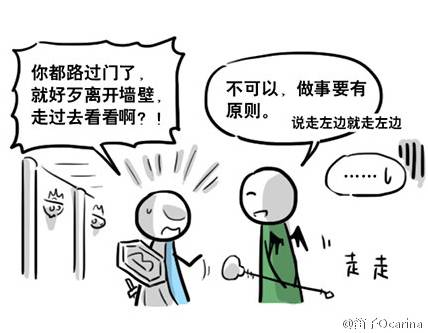

魔王戰前夜 II - 迷宮探索
===

### 小故事

先讓我們來欣賞一段漫畫。

<center>
 <br/>
 <br/>
 <br/>
 <br/>
 <br/>
 <br/>
 <br/>
 <br/>
</center>

> reference: [小綠與小藍 - 魔王城篇](https://ac.qq.com/ComicView/index/id/536332/cid/175)

### 題目敘述

支配世界的大魔王 - [**台大資工b07 程式電神人生勝利組 Joe Tsai 蔡銘軒軒哥**](https://www.facebook.com/%E5%8F%B0%E5%A4%A7%E8%B3%87%E5%B7%A5b07-%E7%A8%8B%E5%BC%8F%E9%9B%BB%E7%A5%9E%E4%BA%BA%E7%94%9F%E5%8B%9D%E5%88%A9%E7%B5%84-Joe-Tsai-%E8%94%A1%E9%8A%98%E8%BB%92%E8%BB%92%E5%93%A5-747149305639649)，雖然有著掌管所有空間與時間的能力，但是其附帶著強大的副作用 -- 祂瞬間移動的所有路徑都會被灰飛煙滅。


> 副作用示意圖 (reference: JOJO 星塵遠征軍 - "亞空瘴氣" 瓦尼拉艾斯 其三)

住在自己城堡的 [**台大資工b07 程式電神人生勝利組 Joe Tsai 蔡銘軒軒哥**](https://www.facebook.com/%E5%8F%B0%E5%A4%A7%E8%B3%87%E5%B7%A5b07-%E7%A8%8B%E5%BC%8F%E9%9B%BB%E7%A5%9E%E4%BA%BA%E7%94%9F%E5%8B%9D%E5%88%A9%E7%B5%84-Joe-Tsai-%E8%94%A1%E9%8A%98%E8%BB%92%E8%BB%92%E5%93%A5-747149305639649)，如果要出自己的城堡會需要經過設計給挑戰者的迷宮。但祂可不能使用瞬間移動能力，否則祂的迷宮就會被自己毀掉了，而，[**台大資工b07 程式電神人生勝利組 Joe Tsai 蔡銘軒軒哥**](https://www.facebook.com/%E5%8F%B0%E5%A4%A7%E8%B3%87%E5%B7%A5b07-%E7%A8%8B%E5%BC%8F%E9%9B%BB%E7%A5%9E%E4%BA%BA%E7%94%9F%E5%8B%9D%E5%88%A9%E7%B5%84-Joe-Tsai-%E8%94%A1%E9%8A%98%E8%BB%92%E8%BB%92%E5%93%A5-747149305639649)的方向感也不是很好，可能會在自己的迷宮迷路。為了避免迷路，所以[**台大資工b07 程式電神人生勝利組 Joe Tsai 蔡銘軒軒哥**](https://www.facebook.com/%E5%8F%B0%E5%A4%A7%E8%B3%87%E5%B7%A5b07-%E7%A8%8B%E5%BC%8F%E9%9B%BB%E7%A5%9E%E4%BA%BA%E7%94%9F%E5%8B%9D%E5%88%A9%E7%B5%84-Joe-Tsai-%E8%94%A1%E9%8A%98%E8%BB%92%E8%BB%92%E5%93%A5-747149305639649)想到了上面漫畫小綠所使用的方法 -- 打算就貼著迷宮的左牆走，直到走出去為止。


身為挑戰者的你，透過某種神奇的黑魔法得知了迷宮的長相，但是在走到與大魔王 [**台大資工b07 程式電神人生勝利組 Joe Tsai 蔡銘軒軒哥**](https://www.facebook.com/%E5%8F%B0%E5%A4%A7%E8%B3%87%E5%B7%A5b07-%E7%A8%8B%E5%BC%8F%E9%9B%BB%E7%A5%9E%E4%BA%BA%E7%94%9F%E5%8B%9D%E5%88%A9%E7%B5%84-Joe-Tsai-%E8%94%A1%E9%8A%98%E8%BB%92%E8%BB%92%E5%93%A5-747149305639649)一決生死前，偉大的大魔法師兼預言家**傑神(Jason)**認為必須要先搜刮完整個迷宮，獲取寶物才有能力與大魔王 [**台大資工b07 程式電神人生勝利組 Joe Tsai 蔡銘軒軒哥**](https://www.facebook.com/%E5%8F%B0%E5%A4%A7%E8%B3%87%E5%B7%A5b07-%E7%A8%8B%E5%BC%8F%E9%9B%BB%E7%A5%9E%E4%BA%BA%E7%94%9F%E5%8B%9D%E5%88%A9%E7%B5%84-Joe-Tsai-%E8%94%A1%E9%8A%98%E8%BB%92%E8%BB%92%E5%93%A5-747149305639649)一戰。為了避免徒勞的搜尋寶物，因此傑神建議你用程式繪製出一張"哪些地方還沒被魔王探索過"的迷宮。你能夠達成傑神給你的任務嗎？

### 輸入說明

一開始有兩個變數$n,m$，表示二維迷宮的高與寬。接下來$n$行表示迷宮的長相。

* $3 \le n, m \le 15$。

* `X`表示牆壁，`I`表示迷宮入口，`O`表示迷宮出口，`.`表示可以走的空地。
* 保證迷宮最外圈都會被`X`包圍，除了`I`和`O`。
* 保證`I`和`O`會在最外圈，並且不會`I`的旁邊就是`O`。
* 保證城堡走得出去。

#### 輸出說明

* 輸出迷宮最後的長相。如果這個區域被軒哥走過了，則用`*`表示。

### 範例輸入1

```
6 9
XIXXXXXXX
X.......X
X...X..XX
X..XX...X
X...X...X
XXXXXXXOX
```
### 範例輸出1

```
XIXXXXXXX
X*******X
X...X.*XX
X..XX.**X
X...X..*X
XXXXXXXOX
```

### 範例輸入2
```
6 9
XOXXXXXXX
X.......X
X...X..XX
X..XX...X
X...X...X
XXXXXXXIX
```
### 範例輸出2
```
XOXXXXXXX
X*.***..X
X***X*.XX
X**XX*..X
X***X***X
XXXXXXXIX
```

> Author: Arvin Liu :)